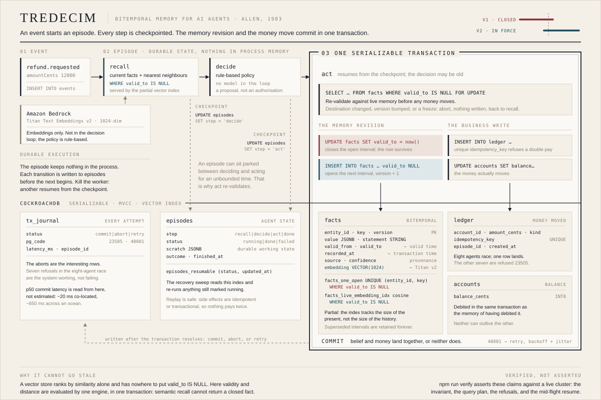

<div align="center">


# TREDECIM

**Bitemporal memory for AI agents**

*Between any two intervals of time there are exactly thirteen possible relations.
James F. Allen proved it in 1983. Tredecim keeps agent memory in terms of those intervals.*

**[Live console →](https://main.d221uow5c9qoz0.amplifyapp.com/)**

</div>

---

<table>
<tr><td>

**One open interval per fact, enforced by the storage engine.** A partial unique index, not
application code. A raw `INSERT` that bypasses the API is refused too.

**Semantic recall that cannot return a stale fact.** Embeddings sit on the fact rows, so
similarity and validity are evaluated by one engine in one query. Rewind the predicate and
the same search runs against an earlier instant.

**Memory and money commit together.** The revision that records a refund and the ledger row
that pays it are one serializable transaction. Neither can outlive the other.

</td><td>

**Durable execution with re-validation.** Every step checkpointed; a worker killed holding a
payment is resumed by another. Because deciding and acting are separated by an unbounded
gap, the decision is re-checked under `FOR UPDATE` before money moves.

**Provenance enforced at the point of payment.** A hostile revision is *recorded*, refusing
to write destroys the evidence, and refused when it would move money.

**64 assertions against a live cluster, including the query plan.**

</td></tr>
</table>

## The problem

A language model has no memory. Everything an agent appears to remember is something the
surrounding system chose to put back in the prompt. So the interesting question is never
*can the agent recall this*, it is **which version of the truth does it recall, and how
does it know that version is still good.**

Most agent memory answers that with vector similarity: embed the conversation, embed the
query, return the nearest neighbours. That works right up to the moment a fact changes.
The old fact still matches the query text, often better than the new one, since it has had
longer to accumulate context, and nothing in the store marks it as dead. The agent
retrieves a superseded truth with full confidence.

In a customer-support toy, that is an annoyance. In anything touching money, it is a
payout to a bank account the customer closed last week.

## The idea

Store every fact with the interval over which it is true, and never delete anything.

```
iban  FR14…9001   valid 13:40 ─────────────► 14:03   closed, retained
iban  FR76…4412   valid          14:03 ──────────────────────────► ∞
```

That is one axis: **valid time**, when a thing is true in the world. The second axis is
**transaction time**, when the system found out. They are not the same, and the gap between
them is where audit questions live:

| Question | Needs |
|---|---|
| What is the IBAN? | neither axis, any database answers this |
| What was the IBAN at 14:02? | valid time |
| What did the agent *believe* at 14:02? | transaction time |
| The agent was wrong, since when do we know? | **both** |

The last row is the one that matters, and it is the one no vector store can answer.

## Why this is not a modelling exercise

Bitemporality is old, Snodgrass wrote the book in 1999, and every serious financial system
has some version of it. What is new is *who is doing the writing*.

A human operator changing a bank account produces one write, reviewed, at human speed. An
agent produces a burst: it reads, decides, retries, runs in parallel with copies of itself,
and can be interrupted at any instruction boundary and resumed minutes later by a different
process. Every property that made bitemporal modelling a bookkeeping nicety under human
load becomes load-bearing under agent load:

| Under a human operator | Under an agent |
|---|---|
| Two edits at the same instant are unlikely | Eight workers take the same event simultaneously |
| A decision and its execution are the same act | They are separated by a durable checkpoint of unbounded length |
| Someone reads the value before acting on it | The value was read at some earlier point that may be stale |
| Provenance is a comment in a ticket | Provenance is the only thing distinguishing a customer from an attacker |
| "What did you know then" is a rare audit | It is the first question after every incident |

That is the argument for putting this in the database rather than in a memory library
beside it. The failures are concurrency failures, and concurrency is what a database is for.

### Where it costs money to be wrong

The demonstration is a refund agent, chosen because the failure is unambiguous and priced.
The same shape appears anywhere an autonomous system acts on a fact that can change
underneath it:

- **Payments and refunds.** Paying a closed account is a recoverable error with an
  unrecoverable cost: the money left, and the customer relationship is the thing that pays
  for getting it back.
- **Access control.** An agent that caches "this user is an administrator" and acts on it
  after the grant was revoked. The revocation is a superseded fact, and nothing in a vector
  store marks it dead.
- **Clinical and regulatory work.** "The patient was not on this medication when the dose
  was calculated" is a bitemporal question, and the answer decides liability.
- **Anything audited.** GDPR, DORA and the EU AI Act all ask what a system knew at the time
  it acted, not what happened to be true. A memory that overwrites cannot answer, and
  reconstructing it from logs afterwards is archaeology.

## How it works

Facts are rows. Revising one closes the open interval and opens a new one, in a single
serializable transaction:

```sql
UPDATE facts SET valid_to = now(), superseded_by = $next
 WHERE entity_id = $e AND key = $k AND valid_to IS NULL;

INSERT INTO facts (entity_id, key, version, value, valid_from, valid_to, …)
VALUES ($e, $k, $next, $value, now(), NULL, …);
```

Both, or neither. There is no instant at which the account has two IBANs, and none at
which it has zero.

That is not enforced by application code. It is enforced by the storage engine:

```sql
CREATE UNIQUE INDEX facts_one_open
  ON facts (entity_id, key)
  WHERE valid_to IS NULL;
```

An agent that tries to assert a second truth without closing the first gets a constraint
violation. So does anything else that talks to the database, a script, a migration, a
second service written by someone who never read this file.

### Embeddings live on the fact rows

The vectors are a column on `facts`, not a separate store. That is the whole argument:

```sql
SELECT statement, embedding <=> $query AS distance
  FROM facts
 WHERE entity_id = $e
   AND valid_to IS NULL        -- ← a standalone vector store has nowhere to put this
 ORDER BY distance
 LIMIT 5;
```

Similarity ranking and validity are evaluated together, by one engine, in one transaction.
Semantic recall *cannot* return a closed fact. Swap the predicate for a `valid_from/valid_to`
window and the same search runs against an earlier instant, similarity restricted to what
was true then.

Making the planner actually *use* the index took two corrections, and both failed
silently, the index existed, `SHOW INDEXES` listed it, and every search was a full scan:

- **The operator class has to match the operator.** `CREATE VECTOR INDEX` defaults to
  `vector_l2_ops`, which serves `<->` only. Ranking by cosine `<=>` against it is not an
  error; the planner simply never picks the index.
- **A full index is not applicable under `valid_to IS NULL`.** The validity predicate
  alone was enough to send the planner back to a scan, even with the operator class fixed.
  The index has to be *partial over the same predicate*.

That restriction turns out to be the right shape rather than a workaround. Only facts in
force are ever semantically recalled, so the index tracks **the size of the present, not
the size of the history**. Keeping every superseded interval forever costs storage and
costs search nothing.

`npm run verify` asserts the query plan, because both failures above look exactly like
success from the outside.

### Provenance is checked where the money moves

Every fact carries a `source`, `tool_verified`, `user_asserted`, `inferred`, and a
`confidence`. Recording that is easy, and on its own worth nothing. The question is whether
anything reads it at the moment being wrong costs something.

Memory poisoning is an active research thread through 2026, with MemSecBench and MemAudit
putting numbers on it, and its characteristic property is that it is **temporally
decoupled**. Nothing happens at the moment of the attack. Someone asserts a new destination
account, in the same words a real customer would use, and it sits in memory looking like
every other fact until an ordinary refund request days later spends it. There is no
malicious prompt to filter and no anomalous request to catch: by then the poisoned value
simply *is* what the memory says.

So the policy is one rule, in one place:

```ts
if (iban.source !== 'tool_verified' || iban.confidence < PAYOUT_CONFIDENCE_FLOOR) {
  throw new UntrustedDestination(…)
}
```

It sits inside `assertStillValid`, the re-validation that already runs under `FOR UPDATE`
in the transaction that writes the ledger row, and deliberately not in `decide`. That
placement is the point. A decision is taken against memory as it was at decision time, and
an episode parked between deciding and acting can be overtaken by an untrusted revision; a
check in `decide` passes that case and pays the attacker. Testing at the moment of the write
means the fact the money actually goes to is the fact that got tested.

Two consequences worth stating plainly:

- **The poison is still recorded.** `assertFact` accepts the hostile revision. A memory that
  refuses to write down what it was told has quietly decided what is true, and has thrown
  away the evidence of the attempt. Recording and acting are different questions; only the
  second is gated.
- **The refusal is terminal, not a retry.** A stale decision is repaired by deciding again.
  An untrusted destination is not, the second decision reads the same fact, so the
  episode ends refused, carrying the provenance that refused it.

This is also where the second temporal axis pays for itself. After a refusal the questions
are *when did this value enter*, *what did it replace*, and *what would have been paid an
hour earlier*, and the history answers all three from rows nothing overwrote. `npm run
verify` section `[10]` asserts the whole path, including that a tool-verified destination
still gets paid, because a policy that refuses everything proves nothing.

### The agent keeps nothing in memory

Every step of an episode is checkpointed to the database before the next begins. Kill the
process at any point and another worker resumes from the checkpoint, because there was
never any state in the process to lose. Side effects are idempotent or transactional, so
replay is safe.

## Architecture



The memory revision and the business write commit **together**. An agent cannot come to
believe it issued a refund that the ledger rejected, and cannot issue a refund it has no
memory of. This is the failure mode that asynchronous memory extraction cannot rule out:
if the memory pipeline runs after the fact, there is a window where the two disagree.

The re-validation inside that box matters more than it looks. `recall`, `decide` and `act`
are separately checkpointed, so an episode can sit parked between deciding and acting for
an unbounded time, which is the point of durable execution. A decision is therefore a
proposal, not an authorisation: before money moves, `act` re-reads the facts it depends on
under `FOR UPDATE`, in the same transaction as the payout. A customer who changes their
bank details while the episode waits is not paid at the account they just replaced.

## Stack

**CockroachDB**

| Used | Where |
|---|---|
| Distributed vector indexing | Partial C-SPANN index over the facts in force, cosine `<=>`, `lib/schema.sql`. The plan is asserted, not assumed |
| Managed MCP Server | `npm run schema-check`, reads the schema the cluster actually holds and fails on drift from what the code depends on. [docs/mcp.md](docs/mcp.md) |
| `ccloud` CLI | `scripts/provision.sh`, provisions and inspects the cluster, with every flag asserted against the installed binary. [docs/operations.md](docs/operations.md) |
| Agent Skills Repo | Applied to this cluster; caught the application user holding admin. [docs/skills/audit.md](docs/skills/audit.md) |
| Serializable transactions | `lib/db.ts`, 40001 retry with exponential backoff and jitter |
| Partial unique index | the one-open-interval invariant |
| `AS OF SYSTEM TIME` | MVCC time travel, `recallViaMVCC` in `lib/memory.ts` |
| Row-level TTL | The journal expires after seven days without a cleanup job to write or monitor, `lib/schema.sql` |

**AWS**

| Used | Where |
|---|---|
| Amazon Bedrock | Titan Text Embeddings v2, 1024-dim, `lib/embeddings.ts` |
| AWS Amplify Hosting | deployment target for the Next.js console |

Embeddings sit behind an interface with a deterministic local implementation, so the test
suite and CI run without cloud credentials. `EMBEDDINGS=local` selects it explicitly.

## Verified, not asserted

Every claim above is checked against a live cluster, and the suite is the reason to trust
the rest of this file:

```bash
npm install
cp .env.example .env.local          # add your CockroachDB connection string
npm run migrate && npm run verify
```

**64 assertions across eleven sections, and the query plan is one of them.** That last part
matters more than the count. Two of the hardest bugs in this project were an index that was
built, listed by `SHOW INDEXES`, and never chosen by the planner, a failure that is
invisible to every test that only checks results. `verify` reads `EXPLAIN` and fails if the
live recall path falls back to a scan.

| Section | Asserts |
|---|---|
| 1 | At most one open interval per (entity, key), including against a raw `INSERT` that bypasses the API |
| 2 | Valid time and transaction time are independently queryable and disagree correctly |
| 3 | Semantic recall is constrained by validity, forwards and rewound |
| 4 | Eight concurrent agents cannot double-pay one request |
| 5 | An episode killed mid-flight resumes and pays exactly once |
| 6 | Event to memory, end to end, including a freeze blocking a later payout |
| 7 | A decision is re-validated against live memory before money moves |
| 8 | The planner uses the partial vector index, with the right operator class |
| 9 | Twelve rapid concurrent revisions all land, none degenerate |
| 10 | Provenance is enforced where money moves, not merely recorded |
| 11 | Money and the memory of it commit together, or not at all |

`npm run e2e` drives a real browser against the deployed console and checks the whole
journey: every scenario runs, the lifeline shows both sides of a revision, the temporal
query answers on both axes, nothing throws, and the layout holds at two viewport sizes.

`npm run bench` reproduces the figures below.

## Run the console

```bash
npm run seed
npm run dev
```

Each button makes one claim you can watch land in the lifeline and the transaction journal:

- **Supersede a fact**, an interval closes, the next opens, nothing is deleted
- **Eight agents, one refund**, concurrent workers race; seven are refused with `23505`
- **Kill a worker mid-flight**, an episode dies between deciding and acting, then resumes
- **Stale-proof recall**, a superseded fact still matches the query text, and stays unreachable
- **Poison the memory**, an untrusted actor asserts a new destination account. The memory
  records it; the payout policy refuses to spend it, and the lifeline shows the instant it
  entered and the tool-verified fact it displaced

The scrubber along the bottom rewinds the memory: pick an instant and the console reports
what was true then, what the agent knew then, and what is in force now, three different
answers from the same rows.

## Benchmark

`npm run bench`. Every figure is end-to-end from the client, so each carries a full
round-trip to `us-east-1` (baseline p50 115 ms), the same code co-located in that region
reports a fraction of these, and that gap is itself the finding. Embeddings use the
deterministic local provider so no model call hides inside a measurement. The run writes
under its own entity namespace and deletes it afterwards.

**Semantic recall against a growing corpus**, once the partial index is actually applicable.
Subtracting the measured network baseline gives the server-side work, which is the honest
comparison:

| open facts | full scan | partial index |
|---:|---:|---:|
| ~600 | 31 ms | 197 ms |
| ~2,100 | 87 ms | 29 ms |
| ~5,100 | 192 ms | 48 ms |
| ~10,100 | 476 ms | **177 ms** |

The scan grows roughly 15× as the corpus grows 18×, which is the linear signature. The
index path is sub-linear and about 2.7× cheaper at ten thousand facts, with the gap
widening. It is not flat, and the small-corpus point is an outlier most likely explained by
index warm-up, one sample, so it is reported rather than explained away.

**Concurrent revisions of the same fact.** 120 writers across four rounds:

| writers | committed | refused | retries | open intervals after |
|---:|---:|---:|---:|---:|
| 2 | 2 | 0 | 0 | 1 |
| 4 | 4 | 0 | 0 | 1 |
| 8 | 8 | 0 | 0 | 1 |
| 16 | 16 | 0 | 0 | 1 |

Contention is paid in latency, not in discarded writes. Two things had to be true for
that: intervals are advanced past the previous start so two revisions inside one clock tick
cannot produce a zero-length interval, and the pool is sized to the concurrency, a writer
holds its connection while waiting on `FOR UPDATE`, so N concurrent revisions need N
connections, and the serverless default starves them into what looks like contention.

**Writes** are 787 ms p50 from Europe: five round-trips per revision, plus the journal write.
**Point-in-time reads** are 139 ms p50 over 205 intervals.

## Notes on the numbers

The console reports p50 commit latency straight from `tx_journal`, because a memory layer
that hides its write latency is not telling you the thing you most need to know.

Measured against the same cluster, same code:

| Where the agent runs | p50 commit |
|---|---|
| Laptop in Europe → cluster in `us-east-1` | ~650 ms |
| Amplify compute in `us-east-1` → same cluster | **18–21 ms** |

Nearly the whole difference is round-trip network. It is worth stating plainly because a
memory layer that commits on every decision turns co-location from a deployment detail into
a design constraint: the same code is roughly thirty times slower when the agent and its
memory are on different continents. An agent architecture that treats its memory as a
remote service it calls occasionally will not notice. One that commits on every decision
will notice on every decision.

The concurrency figures are real too. Running the eight-agent scenario in production
leaves exactly one ledger entry and records the rest as `23505` refusals in the journal 
those aborts are the system working, not failing.

## What this does not do

Stated because a reviewer will find them anyway, and a limit you measured reads better
than one you did not notice.

- **Historical semantic recall scans.** The partial index covers facts in force. A search
  with `asOf` carries a `valid_from/valid_to` window instead, which the partial index
  cannot serve, so it falls back to a scan. That path is analytical and rare; the live
  path is the hot one and it is indexed. Fixing this properly needs a second index per
  time window, which is not worth its write cost here.
- **Writes are chatty.** One revision is five round-trips, `BEGIN`, `SELECT … FOR UPDATE`,
  `UPDATE`, `INSERT`, `COMMIT`, plus the journal write. That is the price of doing the
  close and the open atomically, and it is why co-location matters so much.
- **Facts have no retention policy, deliberately.** The transaction journal expires after
  seven days through CockroachDB's row-level TTL, because it is observability and nothing
  reads a row older than that. `facts` gets none: retaining every superseded interval is the
  claim, and the partial index already means history costs storage rather than query time.
  A deployment with a real retention obligation would attach a TTL to facts closed beyond
  its horizon using the same mechanism, but whose horizon that is belongs to whoever owns
  the data. What this does not have is any story for a deployment that must forget.
- **`AS OF SYSTEM TIME` is bounded by the GC window.** Engine-side time travel reads back
  only as far as `gc.ttlseconds` (raised to 24h on this cluster, 75 minutes by default).
  The durable audit path is the `recorded_at` column, which is why it exists.
- **The policy is rule-based, not model-driven.** The LLM is not in the decision loop.
  Bedrock is used for embeddings only. Routing money through a sampled token stream would
  add noise to the claim under test, which is about the memory layer.
- **The runtime role cannot migrate.** Least privilege split the credential in two: the
  deployed console holds DML on six tables and nothing else, while schema changes need a
  maintainer running as the admin user. Convenient for a demo, correct for production, and
  it means a migration cannot be applied from the running application.
- **The trust policy covers payouts, not every read.** `source` and `confidence` gate the
  destination at the moment money moves, which is where being wrong is expensive. Other
  reads still return facts of any provenance and leave the judgement to the caller. A
  larger system would want the floor per key rather than one constant for the payout path.

## Prior art

The framing owes a lot to work that got here first:

- Allen, *Maintaining Knowledge about Temporal Intervals* (1983), the thirteen relations
- Snodgrass, *Developing Time-Oriented Database Applications in SQL*, bitemporal modelling
- Sumers et al., [*Cognitive Architectures for Language Agents*](https://arxiv.org/abs/2309.02427), the memory taxonomy
- Packer et al., [*MemGPT*](https://arxiv.org/abs/2310.08560), memory as an OS problem
- Rasmussen et al., [*Zep*](https://arxiv.org/abs/2501.13956), temporal knowledge graphs, edge validity intervals
- Chhikara et al., [*Mem0*](https://arxiv.org/abs/2504.19413), extraction and consolidation in production

The gap this fills: those systems model time in a memory layer built beside the database.
Tredecim puts it in the database, so the same transaction that moves the money records why.

## License

Apache 2.0
